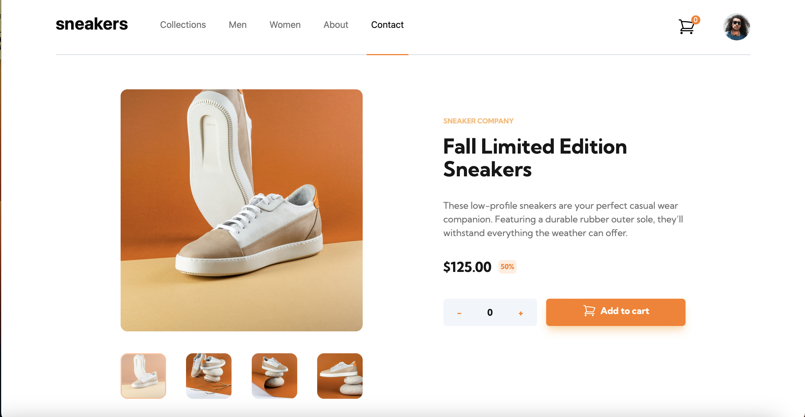

# Frontend Mentor - E-commerce product page solution

This is a solution to the [E-commerce product page challenge on Frontend Mentor](https://www.frontendmentor.io/challenges/ecommerce-product-page-UPsZ9MJp6). Frontend Mentor challenges help you improve your coding skills by building realistic projects.

## Table of contents

- [Overview](#overview)
  - [The challenge](#the-challenge)
  - [Screenshot](#screenshot)
  - [Links](#links)
- [My process](#my-process)
  - [Built with](#built-with)
  - [What I learned](#what-i-learned)
  - [Continued development](#continued-development)
  - [Useful resources](#useful-resources)
- [Author](#author)

## Overview

### The challenge

Users should be able to:

- View the optimal layout for the site depending on their device's screen size
- See hover states for all interactive elements on the page
- Open a lightbox gallery by clicking on the large product image
- Switch the large product image by clicking on the small thumbnail images
- Add items to the cart
- View the cart and remove items from it

### Screenshot



### Links

- Solution URL: [Add solution URL here](https://your-solution-url.com)
- Live Site URL: [Add live site URL here](https://your-live-site-url.com)

## My process

### Built with

- Semantic HTML5 markup
- CSS custom properties
- Flexbox
- CSS Grid
- Mobile-first workflow
- [Angular](https://angular.dev) - JS Framework
- [TailwindCSS](https://tailwindcss.com) - CSS Framework

### What I learned

Angular 17 features with new template syntax, as well as version 3 of the so beloved TailwindCSS (the last I used was v2).
Also tried using angular templating, outlets and such.
For example:
```html
<div>
 @for (item of cart.items; track item) {
        <div class="flex w-full gap-2 items-center my-10">
              
            <div class="flex flex-col mx-2 mdw-4/6 text-neutral-500 text-sm">
                <span>{{ item.name }} </span>
                <p>${{ item.price }} x {{ item.quantity }}
                    <span class="font-bold text-neutral-900">${{ item.quantity * item.price }}</span>
                </p>           
            </div>
            (...svg)
        </div>
    } @empty {
        <p class="text-neutral-500 my-10 text-center">
            Your cart is empty.
        </p>
    }
</div>
```

### Continued development

Next time I would like to look at signals, maybe with a challenge that has more code since this one was mainly ux.

### Useful resources

https://tailwindcss.com is the new Bible. Also official angular documentation.

## Author

- Frontend Mentor - [@thejollydrawker](https://www.frontendmentor.io/profile/thejollydrawker)
